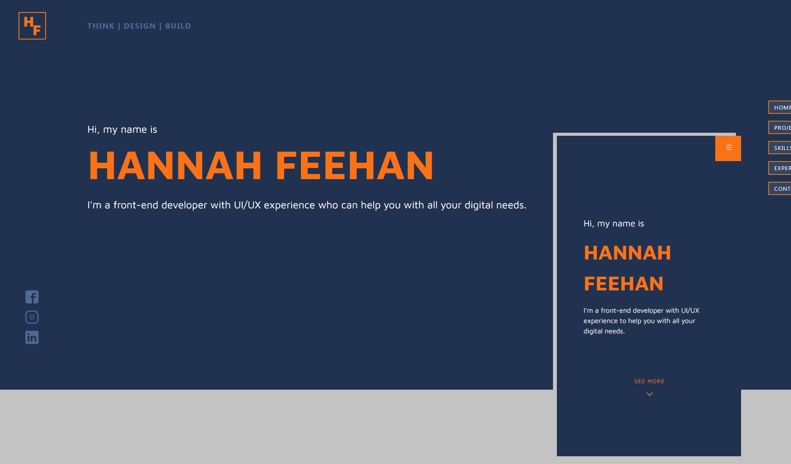

# Hannah Feehan Developer Portfolio

This is my portfolio where I display and demonstrate my skills and experience in the world of development.

## Table of contents

- [Overview](#overview)
  - [The challenge](#the-challenge)
  - [Screenshot](#screenshot)
  - [Links](#links)
- [My process](#my-process)
  - [Built with](#built-with)
  - [What I learned](#what-i-learned)
  - [Continued development](#continued-development)
  - [Useful resources](#useful-resources)
- [Author](#author)
- [Acknowledgments](#acknowledgments)


## Overview

- The core of the portfolio is a SPA, using React's routing to link to my project case study pages
- There is a contact form at the bottom, with links to my relevant social networks
- 

### Screenshot




### Links

- GitHub URL: (https://github.com/hannahf86/portfolio)
- Live Site URL: (https://www.hannahfeehan.com)

## My process

### Built with

- Semantic HTML5 markup
- CSS custom properties
- Flexbox
- CSS Grid
- Mobile-first workflow
- [React](https://reactjs.org/) - JS library
- [Vite](https://vitejs.dev/) - JS Build Tool
- [Tailwind](https://tailwindcss.com/) - Styling
- [Nodejs](https://nodejs.org/en) - Server 

### What I learned

Use this section to recap over some of your major learnings while working through this project. Writing these out and providing code samples of areas you want to highlight is a great way to reinforce your own knowledge.

To see how you can add code snippets, see below:

```html
<h1>Some HTML code I'm proud of</h1>
```
```css
.proud-of-this-css {
  color: papayawhip;
}
```
```js
const proudOfThisFunc = () => {
  console.log('🎉')
}
```


### Continued development

As my skills in development continue to grow, I will also improve my portfolio to match. Recently I incorporated a more advanced navigation menu with a neat animated transition and tidied up my Tailwind styles. In the future, I would like to be able to create an animated landing page for a more exciting user experience, as well as a demonstration of my skills.


### Useful resources

- [Tailwind](https://tailwindcss.com/) - This was my first project using Tailwind and their documentation support was vital on this project
- [MDN Docs](https://www.example.com) 


## Author

- Website - (https://www.hannahfeehan.com)
- GitHub - [hannahf86](https://github.com/hannahf86)
- Twitter - [@HannahFDev](https://twitter.com/HannahFDev)


## Acknowledgments

I'd like to thank Joseph Abell [GitHub:joseph-abell] for checking my code and working with me through GitHub. Cheers Joe!

